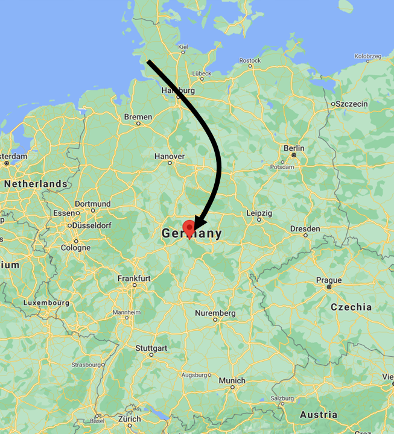

<header>
  <link rel="stylesheet" href="../assets/css/bootstrap.min.css" />
  <link rel="stylesheet" href="../assets/css/style.css" />
  <link rel="stylesheet" href="../assets/css/timeline.css" />
  <link rel="stylesheet" href="../assets/css/all.min.css" />
  <link rel="stylesheet" href="../assets/css/navbar.css" />
  
  
  
  

</header>
<a id="back-button" onclick="scrollToTop(1000);"><i class="fas fa-chevron-up"></i></a>

  <section class="mt-2 col-md-10 offset-md-1 page-container">

        <ul id="timeline" class="timeline">
          

          <li class="timeline-card">
            
Oct 2019

            

              

                
              

              

                Current Job
              

              

                <h3 class="timeline-title">Freelance Software Engineer</h3>
              

              

                <button class="expand-button collapsed" type="button" data-bs-toggle="collapse" data-bs-target="#freelance-card" aria-expanded="false" aria-controls="freelance-card"></button>
                

                    <h4>Things I do</h4>
                    <ul>
                      <li>Working on automated inspection stations for turbine-blades (gas and steam)</li>
                      <li>Estimating and budgeting projects</li>
                      <li>System software development (C# .Net)</li>
                      <li>Owning the deployed solutions and taking care or production interruptions (DevOps)</li>
                      <li>Process engineering (integrating industrial robots, databases, PLCs, MES)</li>
                      <li>State driven robot control</li>
                      <li>Integration of ABB and Fanuc robots</li>
                      <li>
                        Industrial ultrasound-data (NDT) processing (<a target="_blank" href="https://www.hillger-ndt.de/" rel="noopener noreferrer">Hillger</a>)
                      </li>
                      <li>Automatic robot control (process adaptive robot movements)</li>
                      <li>Prototype development for AI-based process automation</li>
                      <li>Concept development for power electronics</li>
                      <li>Documentation (video editing, CGI)</li>
                      <li>Website-Design</li>
                      <li>Tech I like to work with: C#, Python, RAPID, Fanuc TP, MS SQL, HTML+JS+CSS, Vue, Node, Wordpress, Mongo DB, Typescript, AWS, Github, MS Teams</li>
                      <li>How I like to work: Rapid prototyping and agile</li>
                    </ul>
                

              

            

          </li>

          <li class="timeline-card timeline-card timeline-inverted">
            
Jun 2020

            

              

                
              

              

                <h3 class="timeline-title">Co-Founding Member</h3>
              

              

                <button class="expand-button collapsed" type="button" data-bs-toggle="collapse" data-bs-target="#cofounder-card" aria-expanded="false" aria-controls="cofounder-card"></button>
                

                From June 2020 until we parted ways in April 2021. Part of the 4 headed founding team. The project focused on plasma coating technology to
                enable recyclable high barrier packaging. A university spin-off.
                  <h4>I contributed to:</h4>
                  <ul>
                    <li>Responsible for all areas related to power electronics, process and robotics</li>
                    <li>Successful application state-level (`innovation spring`) and federal-level (`Exist-Forschungstransfer`) funding</li>
                    <li>
                      Successful application for an accelerator program
                      <a href="https://www.inam.berlin/admacom-2021-spring" target="_blank" rel="noopener noreferrer">admacom-2021-spring</a>
                    </li>
                    <li>Conception of process control and power electronics</li>
                    <li>Conception of handling system</li>
                    <li>Bill of materials</li>
                    <li>Taking part in video production for pitch-video and script-editor</li>
                    <li>Viability analysis of magnetic flux</li>
                    <li>Prototyping gripper using a 3D-printer</li>
                    <li>Interviewing first employees</li>
                    <li>Video editing video clips used on website and applications</li>
                    <li>
                      Wordpress website design
                      <a href="https://web.archive.org/web/20210803165239/https://ionkraft.com/" target="_blank" rel="noopener noreferrer">link</a> including
                      all animations
                    </li>
                  </ul>
                

              

            

          </li>

          <li class="timeline-card">
            
Jan 2019

            

              

                
              

              

                <h3 class="timeline-title">Fullstack Software Developer</h3>
              

              

                                <button class="expand-button collapsed" type="button" data-bs-toggle="collapse" data-bs-target="#fedger-card" aria-expanded="false" aria-controls="fedger-card"></button>
                

                <a target="_blank" href="https://web.archive.org/web/20191209175308/https://www.fedger.io/" rel="noopener noreferrer">Fedger.io</a> was
                (liquidation at the end of 2019) a startup located in Cologne that focused on hospitality industry with deployed software products to automate
                data extraction from images.
                  <h4>I was working on:</h4>
                  <ul>
                    <li>
                      Internal tooling (feedback system, developer-tools like
                      <a target="_blank" href="https://github.com/AlxndrJhn/drone-desktop-notifier">CI notifications</a>,
                      <a target="_blank" href="https://github.com/AlxndrJhn/ghsprint">automatic report generation</a>)
                    </li>
                    <li>Agile methods (weekly sprint, review, retrospective), extreme programming (pair programming, standups)</li>
                    <li>Reviewing other's code</li>
                    <li>AI-feature implementation using Tensorflow</li>
                    <li>BigQuery database analysis</li>
                    <li>Interface definitions</li>
                    <li>Setting up CI-Pipelines</li>
                    <li>Scalable applications based on PubSub architecture</li>
                    <li>Data-analysis using notebooks</li>
                    <li>Interacting with product owners</li>
                    <li>Improving a PyQt labeling tool</li>
                    <li>Participating in client-meetings as expert</li>
                    <li>Tech stack: Python, Pytest, Dart, HTML+JS+CSS, PostgreSQL, Docker, Drone.io, GCP, Jupyter, Github, metabase, Slack</li>
                  </ul>
                  
                

              

            

          </li>

          <li class="timeline-card timeline-inverted">
            
Dez 2018

            

              

                <h3 class="timeline-title">🚚Moving to Cologne</h3>
              

              

            

          </li>

          <li class="timeline-card">
            
Jul 2017

            

              

                
              

              

                <h3 class="timeline-title">Research Associate</h3>
              

              

                <button class="expand-button collapsed" type="button" data-bs-toggle="collapse" data-bs-target="#wzl-card" aria-expanded="false" aria-controls="wzl-card"></button>
                

                  <h4>I was working on:</h4>
                  <ul>
                    <li>
                      Temporary project lead on a DFG project
                      <a target="_blank" href="https://gepris.dfg.de/gepris/projekt/322750896" rel="noopener noreferrer">Lambda GPS</a>
                    </li>
                    <li>Supporting with lecture (Basics of Electrical Engineering)</li>
                    <li>Project lead including conception, implementation, deployment at the international customer</li>
                    <li>Archicture lead on integration of subsystems like robots, measurement systems, PLC and databases</li>
                    <li>Implementation of sub-system interfaces</li>
                    <li>Modification of existing measurement software to integrated with new system requirements</li>
                    <li>Supervision of student workers</li>
                    <li>Tech stack: Python, C#, Fanuc TP</li>
                  </ul>
                  Check out my <a target="_blank" href="../assets/documents/2018_rwth_wzl_abschluss_zeugnis.pdf">certificate of employment (german)</a>
                

              

            

          </li>

          <li class="timeline-card">
            
Jun 2017

            

              

                <h3 class="timeline-title">✈️Moving to Aachen</h3>
              

              

            

          </li>

          <li class="timeline-card timeline-inverted">
            
Jun 2017

            

              

                
              

              

                <h3 class="timeline-title">Radio interview</h3>
              

              

                Listen to my
                <a
                  target="_blank"
                  href="http://www.radiojustica.jus.br/radiojustica/noticia!visualizarNoticia.action?menuSistema=mn314&entity.id=348415#"
                  rel="noopener noreferrer"
                  >radio interview</a
                >
                about my master's thesis (in portuguese).
              

            

          </li>

          <li class="timeline-card timeline-inverted">
            
Jun 2017

            

              

                
              

              

                PublicationIEEEICRA
              

              

                <h3 class="timeline-title">Distributed multi-robot coordination</h3>
              

              

                Authors: Alexander Jahn, Reza Javanmard Alitappeh, David Saldaña, Luciano C. A. Pimenta, Andre G. Santos and Mario F. M. Campos  
                Location: Singapore  
                Title: Distributed multi-robot coordination for dynamic perimeter surveillance in uncertain environments
                 
                <a target="_blank" href="https://ieeexplore.ieee.org/abstract/document/7989035">Link to paper</a>
                <a href="http://macro.ppgee.ufmg.br/site-map/articles/79-news/116-macro-members-attend-icra-2017" target="_blank" rel="noopener noreferrer"
                  >Link to news</a
                >
              

            

          </li>

          <li class="timeline-card">
            
May 2017

            

              

                
              

              
PublicationOpen Access

              

                <h3 class="timeline-title">Circuit Development</h3>
              

              

                Authors: Manuel Schneider, Alexander Jahn, Norbert Greifzu and Norbert Fränzel  
                Title: Development of a chopper charge amplifier for measuring the cavity pressure inside injection moulding tools and signal optimisation with
                a Kalman filter  
                <a href="https://jsss.copernicus.org/articles/6/199/2017/" target="_blank" rel="noopener noreferrer">Link</a>
              

            

          </li>

          <li class="timeline-card timeline-inverted">
            
Apr 2017

            

              

                
              

              

                <h3 class="timeline-title">Master's Degree in Robotics</h3>
              

              

                Summary: This work addresses the problem of robotic perimeter surveillance for a single robot and a cooperative group of robots.
                 
                Equivalent grade: 1.9 (<a target="_blank" href="../assets/documents/2021_Mestre_Gleichwertigkeit.pdf">RWTH assessment</a>)  
                Check out my
                <a target="_blank" href="../assets/documents/2017_transcript_master.pdf">transcript</a> or
                <a target="_blank" href="https://www.ppgee.ufmg.br/diss_defesas_detalhes.php?aluno=1404" rel="noopener noreferrer"
                  >my master's thesis (at the bottom)</a
                >.
              

            

          </li>

          <li class="timeline-card">
            
Oct 2016

            

              

                
              

              
PublicationIEEE

              

                <h3 class="timeline-title">Sampling Based Path Planning</h3>
              

              

                Authors: Alexander Jahn and Luciano C.A. Pimenta  
                Location: Recife (Brazil)  
                Sampling Based Path Planning and Vector Fields for Curve Tracking by UAVs  
                <a href="https://ieeexplore.ieee.org/abstract/document/7783530" target="_blank" rel="noopener noreferrer">Link</a>
              

            

          </li>

          <li class="timeline-card timeline-inverted">
            
May 2016

            

              

                
              

              
PublicationOpen Access

              

                <h3 class="timeline-title">Embedded Circuit</h3>
              

              

                Authors: M. Schneider, A. Jahn, N. Greifzu and N. Fränzel  
                Title: Entwicklung eines unipolaren differentiellen Ladungsverstärkers für die Anwendung in eingebetteten Diagnosesystemen zur Druckmessung in
                Spritzgussmaschinen  
                <a href="https://www.ama-science.org/proceedings/details/2443" target="_blank" rel="noopener noreferrer">Link</a>
              

            

          </li>

          <li class="timeline-card">
            
Jul 2015

            

              

                
              

              
Award

              

                <h3 class="timeline-title">TEAG-Award for Outstanding Bachelor's Thesis.</h3>
              

              

                Awarded 2500€  
                Check out the <a target="_blank" href="../assets/documents/2016_hsm-hochschuljournal-201601_web.pdf">university report (page 28, top left)</a>
              

            

          </li>

          <li class="timeline-card timeline-inverted">
            
Jun 2015

            

              

                
              

              
Scholarship

              

                <h3 class="timeline-title">Scholarship from CAPES</h3>
              

              
Monthly financial support R$1500. Lasted 2 years.

            

          </li>

          <li class="timeline-card">
            
Mar 2015

            

              

                
              

              

                <h3 class="timeline-title">Start of Master's Studies</h3>
              

              

                UFMG, Robotics group  
                <a href="http://macro.ppgee.ufmg.br/alumni" target="_blank" rel="noopener noreferrer">Alumni page</a>
              

            

          </li>

          <li class="timeline-card">
            
Feb 2015

            

              

                <h3 class="timeline-title">✈️Moving to Brazil</h3>
              

              

            

          </li>

          <li class="timeline-card timeline-inverted">
            
Feb 2015

            

              

                
              

              

                <h3 class="timeline-title">B.Sc. Degree in Electrical Enginneering</h3>
              

              

                Final grade: 1.5 (German system) 
                Title: "Konzeption, Umsetzung und Test einer analogen Signalaufbereitungsschaltung für piezoelektrische Drucksensoren." 
                Check out my <a target="_blank" href="../assets/documents/2015_transcript_bachelor.pdf">transcript and grades</a>
              

            

          </li>

          <li class="timeline-card timeline-inverted">
            
Sept 2014

            

              

                
              

              
PublicationIEEE

              

                <h3 class="timeline-title">Sensor Development</h3>
              

              

                Authors: Alexander Jahn, Falko Ehrle and Carsten Roppel  
                Location: Milan (Italy)  
                Title: "A level sensor for fluids based on hydrostatic deformation with piezoelectric generated sounds in a low frequency range"  
                <a target="_blank" href="https://ieeexplore.ieee.org/abstract/document/6924397" rel="noopener noreferrer">Link</a>
              

            

          </li>

          <li class="timeline-card">
            
Aug 2014

            

              

                
              

              

                <h3 class="timeline-title">Internship</h3>
              

              

                Location: Ilmenau  
                Task: 'Development, Implementation and Test of an Analog Signal Conditioning Circuit for Piezoelectric Pressure Sensors'
              

            

          </li>

          <li class="timeline-card timeline-inverted">
            
Jun 2013

            

              

                
              

              
Scholarship

              

                <h3 class="timeline-title">Book-Money Scholarship from Bosch</h3>
              

              
Monthly financial support €50. Lasted 2 years.

            

          </li>

          <li class="timeline-card">
            
Apr 2013

            

              

                
              

              
Award

              

                <h3 class="timeline-title">Finalist for 'Best Apprentice'</h3>
              

              

            

          </li>

          <li class="timeline-card timeline-inverted">
            
Feb 2013

            

              

                
              

              

                <h3 class="timeline-title">Finished Training as Electrician for Industrial Applications</h3>
              

              

                Final grade: 94%  
                Check out my <a target="_blank" href="../assets/documents/2013_bosch_result.pdf">final grade</a>  
                or my <a target="_blank" href="../assets/documents/2013_bosch.pdf">certificate of employment (german)</a>
              

            

          </li>

          <li class="timeline-card">
            
Nov 2012

            

              

                
              

              

                <h3 class="timeline-title">Working Student Position</h3>
              

              

                              <button class="expand-button collapsed" type="button" data-bs-toggle="collapse" data-bs-target="#working-student-card" aria-expanded="false" aria-controls="working-student-card"></button>
                

                  <h4>Until 2014 was working on:</h4>
                  <ul>
                    <li>Visualization programming (taking Matlab code and translating to C#)</li>
                    <li>Reverse engineering C code of an microcontroller (medical application)</li>
                    <li>Teaching microcontroller programming (in assembly and C)</li>
                    <li>PR work</li>
                    <li>Implementing a Geo-fencing feature for an embedded device using an Ubuntu VM</li>
                    <li>Upgrading teaching material for microcontroller programming to use 64bit drivers</li>
                    <li>Traveling to a conference and presenting a work</li>
                    <li>Tech stack: C#, Matlab</li>
                  </ul>
                Check out the <a target="_blank" href="../assets/documents/2012_FH_Schmalkalden_Contracts.pdf">overview of the 11 contracts</a>
                

              

            

          </li>

          <li class="timeline-card timeline-inverted">
            
Oct 2011

            

              

                
              

              

                <h3 class="timeline-title">Start of Electrical Enginneering Studies</h3>
              

              
Focus on information technology

            

          </li>

          <li class="timeline-card">
            
Sep 2009

            

              

                
              

              

                <h3 class="timeline-title">Start of Apprenticeship</h3>
              

              

                Company: Robert Bosch Fahrzeugelektrik Eisenach GmbH  
                Location: Eisenach  
                Type of education: "Dual-Studies", combines work-training and university studies.  
                <button class="expand-button collapsed" type="button" data-bs-toggle="collapse" data-bs-target="#bosch-card" aria-expanded="false" aria-controls="bosch-card"></button>
                

                  <h4>Tasks:</h4>
                    <ul>
                      <li>PLC programming</li>
                      <li>Flexible assembly systems</li>
                      <li>Sensor basics and application</li>
                      <li>Soldering, working with plastics</li>
                      <li>Supervision and maintenance of industrial devices and machinery </li>
                      <li>Hydraulics and pneumatic circuits</li>
                      <li>Milling and lathe work</li>
                      <li>Installation and wire work</li>
                      <li>Main representative of the apprentices (elected) for the worker union</li>
                      <li>PR work</li>
                      <li>See <a target="_blank" href="../assets/documents/2013_bosch.pdf">complete list</a></li>
                    </ul>
                  

                

              

          </li>

          <li class="timeline-card timeline-inverted">
            
Aug 2009

            

              

                <h3 class="timeline-title">🚚Moving to Thuringia</h3>
              

              

            

          </li>

          <li class="timeline-card">
            
Jun 2009

            

              

                
              

              

                <h3 class="timeline-title">Substitute Group Leader</h3>
              

              

              The department assembled electric fence devices (including PCB soldering line), assembly of road work barriers (including LED soldering, glueing the striped red-white sticker to the barrier and assembly of the spring package) and assembly of agricultural heat lamps.
              <h4>Tasks:</h4>
                <ul>
                  <li>Head of electronics-assembly production department (14 employees)</li>
                  <li>Client and supplier communication</li>
                  <li>Production supervision and planning</li>
                </ul>
                At <a href="https://stiftung-mensch.com/" target="_blank" rel="noopener noreferrer">`Werkstatt Neuwerk`</a>
              

            

          </li>

          <li class="timeline-card">
            
Sept 2008

            

              

                
              

              

                <h3 class="timeline-title">Start of Zivildienst</h3>
              

              

              <h4>Tasks:</h4>
                <ul>
                  <li>Driving services</li>
                  <li>Minor manual work like painting, construction, handy-man</li>
                </ul>
                At <a href="https://stiftung-mensch.com/" target="_blank" rel="noopener noreferrer">`Werkstatt Neuwerk`</a>
              

            

          </li>

          <li class="timeline-card timeline-inverted">
            
Jun 2008

            

              

                
              

              

                <h3 class="timeline-title">Abitur at Gymnasium Heide Ost</h3>
              

              

                Final grade: 2.9 (German system)  
                Check out my <a target="_blank" href="../assets/documents/2008_abitur.pdf">abitur</a>
              

            

          </li>

          <!-- Ending -->
          

          <li class="last">
            
1988

            

              

              

                <h3 class="timeline-title">Born and raised in Schleswig-Holstein</h3>
              

              

            

          </li>
        </ul>

  </section>

